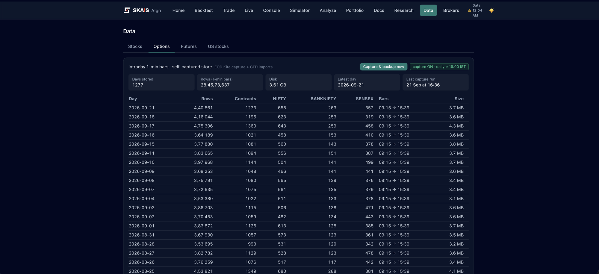
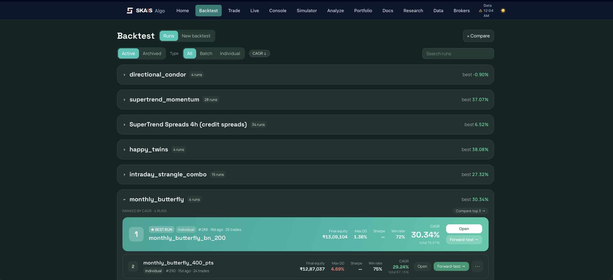
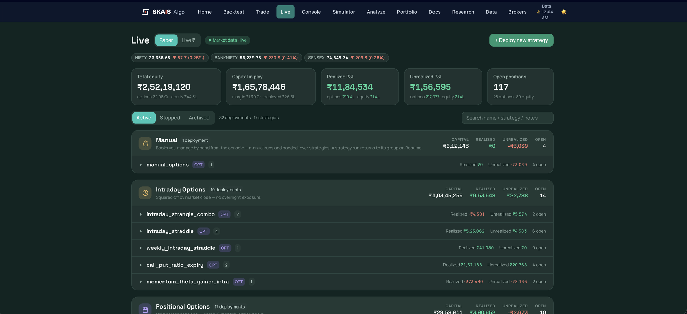
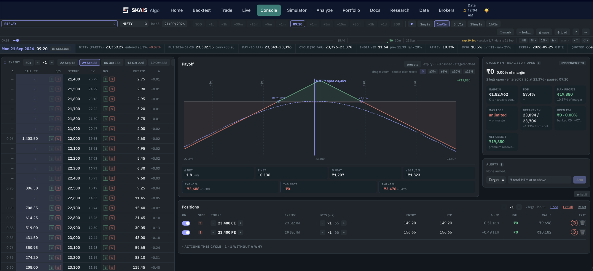
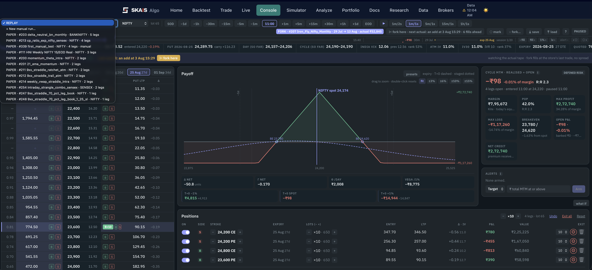
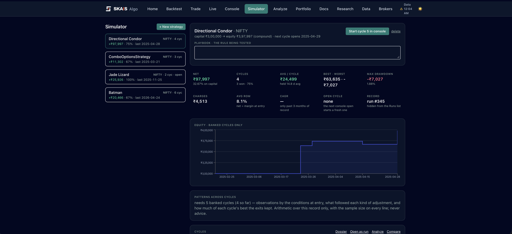
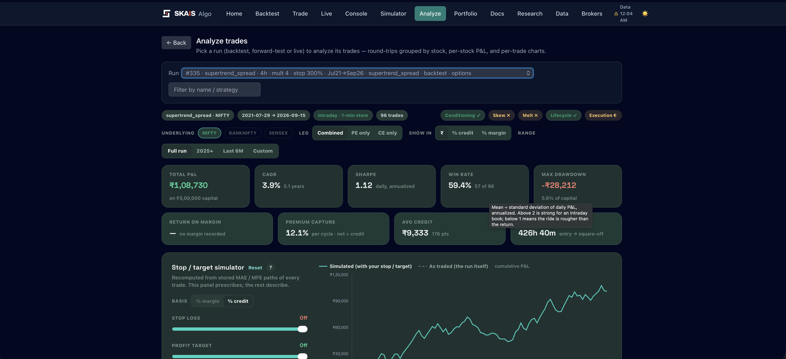
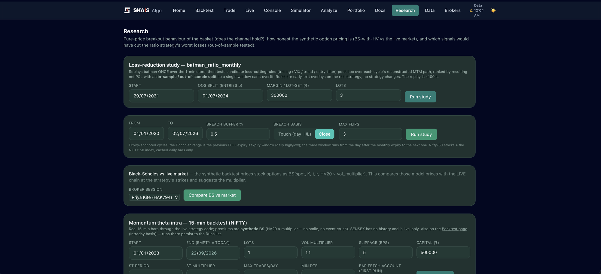
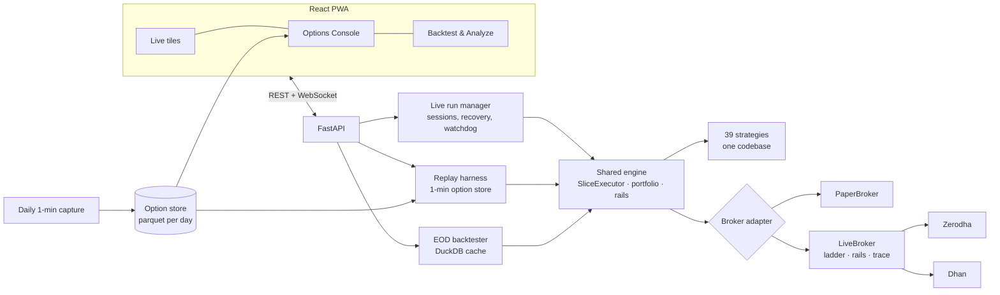

# SKAS Algo — one engine for backtest, paper and live

> A single-operator trading platform for Indian index options and equities. What you
> backtest is what you paper-trade, and what you paper-trade is what goes to the broker:
> one strategy codebase, one execution engine, and only the clock, the data feed and the
> broker adapter swap between modes.

Built from June 2026 in about 540 commits. Not a product and not advice: a working system
for one operator, published so the engineering can be read.

## In numbers

| | |
|---|---|
| Strategies | 39 registered (index options and equity), one codebase for all three modes |
| Tests | 1,520, including parity suites that pin backtest = paper = live |
| Option data | 1,277 sessions of self-captured 1-minute bars, 284 million rows, 3.6 GB |
| Paper fleet | 32 deployments across 17 strategies on one box, 117 open positions |
| Brokers | Zerodha (Kite) and Dhan behind one gated order path |
| Live sessions | 20 recovered on every restart of the production box |

## A tour

### The data comes first


Intraday option strategies have no honest backtest on daily bars, and the contracts that
matter (near the money, near expiry) change every day. So after every close the platform
captures 1-minute bars for every NIFTY, BANKNIFTY and SENSEX contract within 10% of spot and
40 days of expiry: about a thousand contracts and four lakh rows a day, one parquet file per
session, mirrored off-box. The years before capture began were filled from a purchased
import. Everything intraday in this repository replays on this store.

### Backtests are runs, grouped by what they test


A run is a run whether it came from the daily-bar engine or the 1-minute replay: the same
report contract, the same trade log, the same cycle table. Runs group by strategy and rank
by CAGR, a best run can become a template, and any run forwards into a paper deployment
with its exact parameters. The list is honest about losers: the newest strategy at the top
finished its five-year replay at −0.90% and stays there, ranked, beside the ones that work.

### Paper is the same code with a simulated broker


The Live page runs paper and real money from one screen; the toggle is the only difference,
and the figures above are the PAPER fleet. Deployments group by how long they hold: intraday
books squared off by the close, positional books held across sessions, and a Manual section
for books a human is managing by hand. Every tile answers the same questions: capital,
realised, unrealised, open legs, why the strategy is waiting, and what it will do next.

### The Options Console: any day, minute by minute


Open any captured session, click the chain to build a structure, and step the clock. The
payoff, the greeks, the breakevens, the probability of profit and the cycle P&L re-derive
at every minute from the tape. Presets resolve at the cursor (a "25-delta" is the 25-delta
of that minute), a click on the opposite side nets the leg, and Undo takes back a whole
action. Margin comes from the broker's own calculator for the same structure on today's
chain, labelled by source.

### Fork what really happened


Pick a deployment's cycle, closed or still open, and the console reopens on its entry day
with the actual fills. Step forward and the real adjustments arrive one by one; press
"fork here" and the rest of the tape is dropped, so you trade the same minute differently.
The strip compares the actual outcome with yours. The picker lists every paper and live run
holding positions, on this box or, over a read-only peer link, on the production box.

### The Simulator: a backtest whose decisions are yours


A Simulator strategy is a playbook traded by hand, cycle by cycle, in the console. Each
banked cycle keeps its tape, every decision's context (spot, IV rank, VIX, greeks, the payoff
shape at that minute) and the operator's own note, so a later review judges the decision on
what was known, not on what followed. Counterfactuals replay each cycle under mechanical
rules, and across five or more cycles the record reports patterns as arithmetic, never advice.

### Analyze: what the rules would have done


Every replay stores each trade's adverse and favourable excursion, so a stop or target can be
tried after the fact without re-running anything. The panel above prescribes; the rest of the
page describes: conditioning by VIX and IV rank, skew, premium melt and lifecycle.

### Research: the studies behind the rules


Rules earn their place here. The loss-reduction study replays a strategy once and tests
candidate exits post hoc with an in-sample/out-of-sample split, which is how a trailing stop
that looked like +₹20k in one window was found to lose ₹79k in the next, and how the one
robust filter (a volatility risk-premium gate at entry) was kept.

## What is different about it

**The parity invariant.** The engine (`engine/execution.py`) is shared by the backtester, the
paper trader and the live loop. Mode-equivalence tests assert that a backtest and a paper
replay of the same days produce byte-identical books. Every options-only branch is gated so
the equity backtest never changes under it.

**Honest marks.** A replay marks an option at its last trade floored at intrinsic, and a print
older than five minutes is not a print: the strategy defers rather than acts. Live, longs
mark at the bid and shorts at the ask, against the real fills. Paper fills at the live spread,
so a paper cycle measures execution cost.

**Safety engineering for real money.** One order path with a limit-at-touch ladder that
snaps to the instrument's tick, per-order notional caps, a daily order cap, market-hours
checks, book reconciliation against the broker, a structured `ORDER` trace with one
correlation id per lifecycle, and a rule that an unfilled order or a book mismatch halts the
run until a human acknowledges it.

**Four keys for a real order.** Live mode, an armed account, a process-level flag, and an
adapter with the full order surface. Miss one and the order paper-fills, with a chip saying
so. The AI assistant that pairs on this codebase is under a standing directive never to
place, arm or verify a real order.

**The hand pauses the machine.** When a human edits a running strategy's book, the strategy
is paused and a small rail takes over its stop and target. A strategy's rule on a book it did
not build is a different rule; it is not applied at all.

## Architecture



**How a trade flows.** A strategy's `on_slice` reads prices through a market view (cache,
replay tape or a live quote source) and returns signals. The override resolver applies
per-position rules and turns them into actions. The executor books the actions through the
broker adapter: a backtest fills at the slice close, paper at the live bid/ask, live through
the ladder. Fills, charges, greeks and P&L are persisted the same way in every mode, so the
run pages, the cycle tables and the analytics read one shape.

## Read more

- [Design decisions](docs/showcase/design-decisions.md): the rules that shaped the platform and why.
- [Lessons from live](docs/showcase/lessons-from-live.md): incidents from real trading and what each changed.
- [Feature catalog](docs/FEATURES.md) and the [as-built architecture](docs/ARCHITECTURE.md).
- [Developer and operator notes](docs/README-dev.md): setup, seams, how to run.

## Try it without a broker

```bash
scripts/demo.sh        # seeds synthetic option days into its own store, serves on :8090
```

Then open the console on any seeded day, or run an intraday backtest of any options strategy
on them. The demo uses its own database and store; nothing it does can reach real data.
